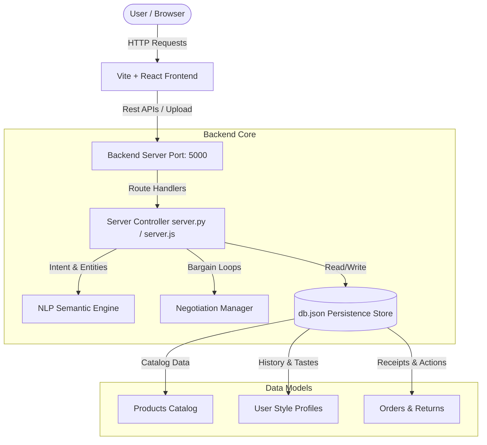

# OmniAssist: Hyper-Personalized Conversational Shopping Assistant

OmniAssist is a next-generation full-stack conversational e-commerce sales associate. Modeled to replicate the high-touch premium service of in-store sales representatives, it parses complex, multi-variable shopping queries, dynamically builds style profiles over chat interactions, provides size/fit warnings from return records, handles post-purchase requests, and engages in interactive price bargaining based on seller parameters.

---

## 📸 Interface Preview
The interface features a side-by-side dashboard design:
*   **Left Pane**: Standard e-commerce product catalog (Amazon/Flipkart styling) with categories, size selectors, and cart checkout.
*   **Right Pane**: The Conversational Shopping Assistant with message history, interactive Bargain HUD, quick prompts, visual search upload, and an evolving Style Profile builder.

---

## 🛠️ Architecture & System Design



---

## 🌟 Key Features

### 1. Custom Semantic NLP Parser
Parses multi-constraint natural language phrases like:
> *"I need something for my sister's engagement ceremony, she likes pastels, budget around five thousand, she's petite"*
*   **Entity Extraction**: Automatically isolates Category (`fashion`), Occasion (`engagement`), Budget Limit (`5000`), Colors (`pastels`), and Style tags (`petite`).
*   **Smart Search**: Scores and re-ranks the product catalog to surface matching pastel lavender gowns at the top of the browser.

### 2. Sizing & Fit Advisor (🧬 Machine Learning Log)
Learns size constraints based on customer transaction histories and return reasons:
*   If a customer returns a size M garment with the reason **"too-tight"**, the advisor updates their Fit profile.
*   When the user attempts to add a **"runs-small"** (slim-fit) fashion item in size M to their cart, a proactive sizing warning is triggered, recommending size L.

### 3. Interactive Price Negotiation Module (🤝 Bargaining HUD)
Engages in realistic bargaining sessions when prompted:
*   Evaluates offers against product parameters: `minPrice` (seller's rock bottom), `originalPrice`, and `flexibility` (seller willingness to yield).
*   Manages counteroffers dynamically over 3 rounds.
*   Displays a custom, glowing **Bargain HUD widget** directly in the conversation with quick **Accept Offer** and **Counter Offer** actions.
*   Grants custom coupon codes (e.g. `BARGAIN_P1`) once an agreement is achieved.

### 4. Style Profile Builder
Gradually captures user preferences over sessions:
*   **Evolving Preferences**: Updates typical budget bounds, color palettes (e.g. pastel mint, peach), and style aesthetics (e.g. traditional, minimalist) from chat inputs.
*   **Visual HUD Dashboard**: Displays real-time updates of the user’s logged preferences.

### 5. Visual Search Integration
Allows users to upload photos (like a dress color reference or ring style):
*   Parses filename metrics/image structures.
*   Retrieves catalog items matching the detected color aesthetic and inserts them directly into the recommended stream.

### 6. Post-Purchase Support
*   **Order Tracking**: Check the status and fulfillment updates of orders directly inside the chat (e.g. *"Track my order #o1001"*).
*   **Returns/Exchanges Drawer**: Click "Return" on any delivered order in the profile tab or type *"Return order"* in chat to launch a returns drawer.

---

## ⚡ Setup & Execution

You have the choice of running either a **Python (Flask)** or **Node.js (Express)** backend. The front-end connects to port 5000 automatically.

### 📦 Prerequisites
- [Node.js](https://nodejs.org/) (v18+)
- [Python 3](https://www.python.org/) (v3.8+)

---

### Option A: Python Backend (Flask) - [Recommended]
1.  Navigate to the backend directory:
    ```bash
    cd be
    ```
2.  Install Python packages:
    ```bash
    pip install -r requirements.txt
    ```
3.  Launch the backend server:
    ```bash
    python server.py
    ```
    *The server runs on http://localhost:5000*

---

### Option B: Node.js Backend (Express)
1.  Navigate to the backend directory:
    ```bash
    cd be
    ```
2.  Install dependencies:
    ```bash
    npm install
    ```
3.  Launch the backend server:
    ```bash
    npm start
    ```
    *The server runs on http://localhost:5000*

---

### Frontend Setup (Vite + React)
1.  Open a new terminal and navigate to the frontend directory:
    ```bash
    cd fe
    ```
2.  Install dependencies:
    ```bash
    npm install
    ```
3.  Start the Vite developer build server:
    ```bash
    npm run dev
    ```
4.  Open your browser and navigate to **[http://localhost:5173/](http://localhost:5173/)** to access the dashboard!
